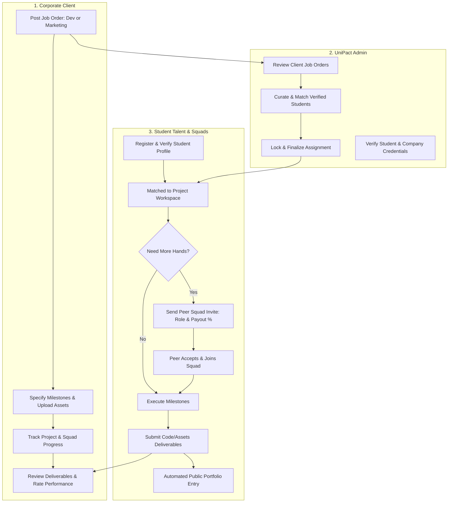

# 🚀 UniPact v3.0 — Enterprise Student Talent Marketplace & Collaboration Platform

> **"Connecting Ambitious Student Talent with Verified Enterprise Opportunities"**  
> UniPact is an enterprise-grade higher-education talent marketplace and collaboration platform. UniPact connects corporate clients with curated university student talent across **Software Development** and **Digital Marketing**, featuring admin-curated matching, peer-to-peer student squad collaboration, transparent milestone payouts, and verifiable student portfolios.

---

## 📑 Table of Contents
1. [Executive Overview](#-executive-overview)
2. [Dual-Track Architecture (V3.0 & V2.2.1 Coexistence)](#-dual-track-architecture)
3. [Design System & UI Style Lock](#-design-system--ui-style-lock)
4. [Tech Stack & System Architecture](#-tech-stack--system-architecture)
5. [User Roles & Key Workflows](#-user-roles--key-workflows)
6. [Core Subsystems](#-core-subsystems)
   - [Client Job Order Pipeline & Milestones](#1-client-job-order-pipeline--milestones)
   - [Admin Curation & Talent Matching](#2-admin-curation--talent-matching)
   - [Student Squad Collaboration & P2P Invitations](#3-student-squad-collaboration--p2p-invitations)
   - [Deliverables, Milestone Reviews & Portfolios](#4-deliverables-milestone-reviews--portfolios)
   - [Postponed V2.2.1 Club & Guild Sponsorship Engine](#5-postponed-v221-club--guild-sponsorship-engine)
7. [Project Directory Structure](#-project-directory-structure)
8. [Quickstart & Local Setup](#-quickstart--local-setup)
9. [API Endpoint Reference](#-api-endpoint-reference)
10. [Test & Verification Protocol](#-test--verification-protocol)

---

## 🌟 Executive Overview

Traditional university freelancing and internship placements are fragmented, lack accountability, and fail to track individual student contributions in team settings. **UniPact v3.0** modernizes campus talent acquisition through:
- **Curated Enterprise Matching**: Companies submit structured job orders (Software Development or Digital Marketing). UniPact Admin curates and matches verified students based on skills, academic focus, and track ratings.
- **Peer-to-Peer Squad Collaboration**: When a project requires multi-disciplinary talent (e.g. Lead Engineer, UI/UX Designer, and Content Creator), assigned students can directly invite peer students to form a squad, delegate roles, and define transparent payout share splits.
- **Centralized Workspaces & Milestone Tracking**: Centralized repository URLs, raw client marketing assets, revision threads (up to 2 revisions per milestone), and artifact uploads.
- **Automated Verifiable Portfolios**: Each completed project automatically creates an immutable showcase item on the student's public portfolio highlighting their exact contribution statement and verified client rating.

---

## ⚖️ Dual-Track Architecture

UniPact operates a dual-track architecture designed for seamless coexistence:

| Track | Target Audience | Primary Focus | Status |
| :--- | :--- | :--- | :--- |
| **V3.0 (Primary)** | Individual Students (`role: "STUDENT"`) & Companies (`role: "COMPANY"`) | Individual talent marketplace, curated admin matching, peer squad collaboration, milestone deliverables. | **Active & Live** |
| **V2.2.1 (Preserved)** | Student Clubs/Guilds (`role: "CLUB"`) & Corporate Patrons | Club sponsorships, hackathons, brand ambassadorships, 365-day rank decay, shadow users & presidency succession. | **Postponed (Fully Intact)** |

> [!IMPORTANT]
> Per architectural locks, SRS v2.2.1 models and endpoints (`ClubProfile`, `ShadowUser`, `Application`, `Membership`) are strictly preserved and tested to prevent future migration conflicts.

---

## 🎨 Design System & UI Style Lock

All user interfaces strictly comply with [`STYLE_GUIDE.md`](./STYLE_GUIDE.md) and [`AGENTS.md`](./AGENTS.md), projecting a trustworthy, enterprise B2B aesthetic:

- **Color Tokens**:
  - Primary Navy (`#0B1E63`) & Deep Navy (`#0A1748`)
  - Action Cyan (`#00AEEF`) & Deep Cyan hover (`#0090C6`)
  - Canvas Background (`#F5F7FC`) & Surface White (`#FFFFFF`)
  - Main Text (`#0A1748`) & Muted Text (`#5B6478`)
  - Soft Border (`rgba(10, 23, 72, 0.12)`) & Strong Border (`rgba(10, 23, 72, 0.22)`)
- **Typography**:
  - Headings: `Outfit` (Bold 700, `#0A1748`)
  - Body & Controls: `Inter` (Regular 400, Medium 500, Semi-bold 600)
- **Layout**: Container max-width `1160px`, sticky glassmorphic navbar (`76px`), cyan eyebrow tags with diamond accents, zero attribute occlusion.

---

## 🏗️ Tech Stack & System Architecture

```
                                  +---------------------------------------+
                                  |         React 19 + Vite 7 SPA         |
                                  |   Tailwind CSS 3 (Enterprise Navy/Cyan) |
                                  |    Axios Client (withCredentials)     |
                                  +-------------------+-------------------+
                                                      |
                                         REST API / HttpOnly Cookies
                                                      |
                                  +-------------------v-------------------+
                                  |         Django 6 / Django REST        |
                                  |        CookieJWTAuthentication        |
                                  +---+-----------+-----------+-------+---+
                                      |           |           |       |
                 +--------------------+           |           |       +--------------------+
                 v                                v           v                            v
          [ users app ]                   [ campaigns app ] [ payments app ]       [ reviews app ]
   - Custom User (STUDENT, COMPANY,      - Job Orders        - Treasury Summary    - 5-Star Ratings
     ADMIN, CLUB)                        - Admin Matching    - Subscriptions       - 365d Rolling Rank Decay
   - StudentProfile (Portfolio & Skills) - Squad Invitations - Mock Stripe Gateway - Client Feedback
   - CompanyProfile & SSM Verification   - Deliverables
   - ShadowUser (V2.2.1 Coexistence)     - Milestones & Assets
```

### Frontend
- **Framework**: React 19, Vite 7, React Router DOM v7
- **Styling**: Tailwind CSS 3.4 + Custom Enterprise Tokens (`STYLE_GUIDE.md`)
- **Icons**: Lucide React
- **HTTP Client**: Axios configured with `withCredentials: true`

### Backend
- **Framework**: Python 3.12+ / Django 6.0 with Django REST Framework (DRF)
- **Authentication**: `djangorestframework-simplejwt` wrapped in custom `CookieJWTAuthentication` (reads access/refresh tokens directly from secure HttpOnly cookies with Bearer header fallback)
- **Database**: SQLite (local development) / PostgreSQL (production-ready)
- **Document Engine**: ReportLab (automated PDF report generation)

---

## 👥 User Roles & Key Workflows



---

## 🧩 Core Subsystems

### 1. Client Job Order Pipeline & Milestones
- **Specialized Domains**: Companies choose between **Software Development** (Full-Stack, Mobile, DevOps, AI/ML) and **Digital Marketing** (Content Creation, SEO, Social Media Campaigns).
- **Structured Milestones**: Multi-stage delivery (e.g., Milestone 1: Wireframes/Draft, Milestone 2: Core Build/Assets, Milestone 3: Final Launch & Handoff).
- **Revision Safeguards**: Digital marketing workflows include up to two structured revisions with central storage for raw brand assets.

### 2. Admin Curation & Talent Matching
- Eliminates spam and competitive bidding races.
- UniPact Admin reviews incoming client job orders and matches verified students (`assigned_students`) based on domain focus, university credentials, and performance ratings.
- Match notes provide students with immediate onboarding context.

### 3. Student Squad Collaboration & P2P Invitations
- Modeled via [`ProjectTeamInvitation`](unipact-backend/campaigns/models.py).
- An assigned student can invite any verified student to their project squad.
- **Invitation Parameters**:
  - `role_in_project`: e.g. "Frontend Architect", "Video Editor", "Copywriter".
  - `payout_share_percentage`: Proposed cut from milestone funds.
  - `notes`: Specific task assignment instructions.
- Upon acceptance, the peer is automatically enrolled into `assigned_students` and receives workspace access.

### 4. Deliverables, Milestone Reviews & Portfolios
- Students submit repository URLs, staging links, or packaged assets along with individual contribution statements.
- Verified client ratings directly feed into the student's rating score and public portfolio.

### 5. Postponed V2.2.1 Club & Guild Sponsorship Engine
- University club sponsorships, hackathon bounties, and guild leadership transfers remain intact for future university administration rollouts.

---

## 📁 Project Directory Structure

```
unipact-mvp/
├── .agents/skills/                   # Architecture & style enforcement skills
├── AGENTS.md                         # Global agent rules and style locks
├── STYLE_GUIDE.md                    # Official UniPact Enterprise design system
├── UniPact_wireframe_V3_0.md         # V3.0 UI/UX wireframe specifications
├── README.md                         # Main documentation
│
├── unipact-backend/                  # Django REST Framework API
│   ├── manage.py
│   ├── requirements.txt
│   ├── unipact_backend/              # Core settings, JWT cookie auth, URLs
│   ├── users/                        # Auth, StudentProfile, CompanyProfile, ShadowUser
│   ├── campaigns/                    # Campaigns, Milestones, Team Invitations, Deliverables
│   │   ├── migrations/               # Database migrations (0007-0009 V3.0)
│   │   ├── test_v3.py                # Comprehensive V3.0 unit tests
│   ├── payments/                     # Subscriptions, Mock Stripe, Treasury
│   └── reviews/                      # Performance evaluations & rank decay
│
└── unipact-frontend/                 # React 19 + Vite 7 Single Page Application
    ├── package.json
    ├── tailwind.config.js            # Navy & Cyan tokens from STYLE_GUIDE.md
    └── src/
        ├── api/client.js             # Axios client with credentials
        ├── components/               # Navbar, ProtectedRoute, Modals
        └── pages/                    # StudentDashboard, AdminDashboard, CreateCampaign, etc.
```

---

## ⚡ Quickstart & Local Setup

### Prerequisites
- **Python 3.12+**
- **Node.js 20+** & **npm**

### 1. Backend Setup
```bash
cd unipact-backend
python -m venv venv

# Windows
venv\Scripts\activate
# macOS/Linux
source venv/bin/activate

pip install -r requirements.txt
python manage.py migrate
python manage.py runserver
```
Backend API will be available at `http://127.0.0.1:8000/`.

No `.env` file is needed locally: you get DEBUG mode, SQLite, local file storage, and **emails printed to the backend terminal** instead of being sent (handy for testing password resets and notifications). See `unipact-backend/.env.example` for every setting.

**Demo data (local only):** `python create_seed_users.py` creates demo accounts for every role (see the script for their passwords). The seed scripts refuse to run when `DJANGO_ENV=production`.

**Real admin account:** `python manage.py create_admin --email you@example.com` (asks for a strong password).

### 2. Frontend Setup
```bash
cd unipact-frontend
npm install
npm run dev
```
Frontend application will be accessible at `http://localhost:5173/`.

For production builds, see `unipact-frontend/.env.example` (API address, public site URL for link previews, legal page details, optional Sentry) and [DEPLOYMENT.md](DEPLOYMENT.md).

---

## 📡 API Endpoint Reference

All endpoints use HttpOnly cookie authentication. Sign-in, sign-up, password reset and token refresh are rate limited per IP.

### Accounts
| Endpoint | Method | Description |
| :--- | :--- | :--- |
| `/api/users/register/student/` · `/company/` · `/club/` | `POST` | Create an account (requires `accept_terms: true`) |
| `/api/users/login/` · `/logout/` · `/token/refresh/` | `POST` | Sign in, sign out, refresh the session cookie |
| `/api/users/me/` | `GET` | The signed-in account |
| `/api/users/me/settings/` | `GET` `PATCH` | View or update your own profile and verification document |
| `/api/users/password/change/` | `POST` | Change password (`current_password`, `new_password`) |
| `/api/users/password/forgot/` | `POST` | Email a password reset link (same response whether or not the email exists) |
| `/api/users/password/reset/` | `POST` | Set a new password with `uid` + `token` from the email |
| `/api/users/student/<user_id>/profile/` | `GET` | Public student portfolio |

### V3.0 Projects & Team Collaboration
| Endpoint | Method | Description |
| :--- | :--- | :--- |
| `/api/campaigns/?mode=my_campaigns` | `GET` | A company's own projects (`POST /api/campaigns/` creates one) |
| `/api/campaigns/<id>/` | `GET` | Project detail (workspace files only for owner, team and admins) |
| `/api/campaigns/<id>/finalize/` | `POST` | Company confirms the proposed match (finder's fee on Free plan) |
| `/api/campaigns/<id>/assets/` | `GET` `POST` | Project files vault |
| `/api/campaigns/student/assigned/` | `GET` | Projects assigned to the signed-in student |
| `/api/campaigns/<id>/student-deliverable/` | `POST` | Submit a link and/or file with a contribution note |
| `/api/campaigns/<id>/team/invite/` | `POST` | Invite another student (`email`, `role_in_project`, `payout_share_percentage`) |
| `/api/campaigns/<id>/team/` | `GET` | Team members and pending invitations |
| `/api/campaigns/team/invitations/me/` | `GET` | Invitations received by the signed-in student |
| `/api/campaigns/team/invitations/<id>/respond/` | `POST` | Accept or decline (`action`) |
| `/api/campaigns/<id>/complete/` | `POST` | Approve work, rate (1–5) and complete the project |

### Admin
| Endpoint | Method | Description |
| :--- | :--- | :--- |
| `/api/users/admin/queue/` · `/stats/` · `/logs/` | `GET` | Verification queue, dashboard stats, activity log |
| `/api/users/admin/verify/<TYPE>/<id>/` | `POST` | Approve, reject or flag an account (emails the user) |
| `/api/users/admin/entities/` · `/users/<id>/block/` | `GET` `POST` | User directory, block or unblock |
| `/api/users/admin/students/` | `GET` | Student pool for matchmaking |
| `/api/campaigns/<id>/match/` | `POST` | Propose students for a project (`student_ids`, `match_notes`) |

### Billing
| Endpoint | Method | Description |
| :--- | :--- | :--- |
| `/api/payments/create-intent/` → `mock-checkout/<id>/` → `confirm/<id>/` | `POST` | Demo checkout flow (no real charge) |
| `/api/payments/history/` · `/treasury/` | `GET` | Payment history and plan summary |

### Transactional emails
Sent automatically (see `unipact_backend/notifications.py`): welcome, account verified/rejected, password reset and changed, match proposed (company and students), match confirmed, team invitation and reply, work submitted, project completed, club proposal received and contract awarded, payment receipt.

---

## 🧪 Test & Verification Protocol

The repository enforces mandatory verification gates:

### 1. Backend Test Suite
```bash
cd unipact-backend
python manage.py test
```
*Current Status*: **83/83 tests passing** covering V3.0 matching and team collaboration, access control, uploads, rate limits, production settings, password reset, account settings, emails, sign-up consent, admin commands and the postponed V2.2.1 club track.

### 2. Frontend Lint & Production Build
```bash
cd unipact-frontend
npx eslint src
npm run build
```
*Current Status*: **0 lint errors, 0 build errors**.
