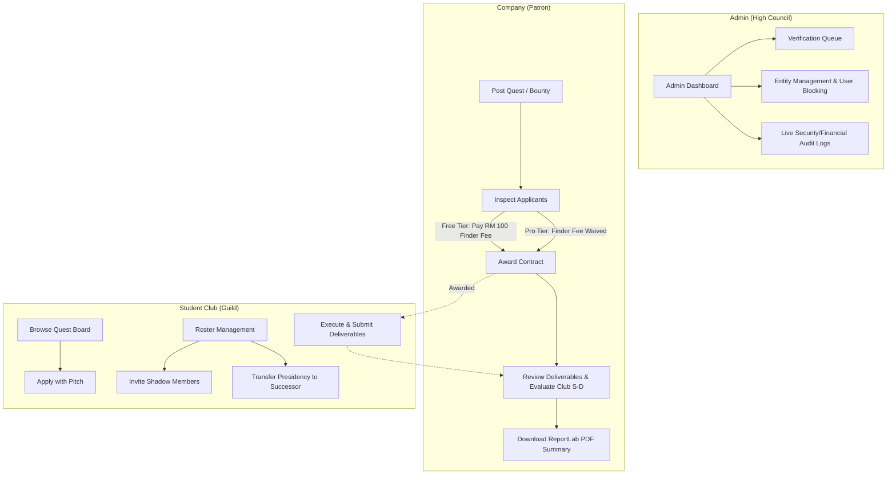

# 🛡️ UniPact — Gamified B2B & Student Guild Marketplace (MVP)

> **"Where Ambition Meets Opportunity"**  
> UniPact is a cyberpunk-themed, gamified B2B and higher-education marketplace platform connecting corporate sponsors (*"Patrons"*) with university student clubs and societies (*"Guilds / Hunters"*) for bounties, brand ambassadorships, and hackathons.

---

## 📑 Table of Contents
1. [Executive Overview](#-executive-overview)
2. [Tech Stack & Architecture](#-tech-stack--architecture)
3. [User Roles & Key Workflows](#-user-roles--key-workflows)
4. [Subsystem Breakdown](#-subsystem-breakdown)
   - [Quest & Application Pipeline](#1-quest--application-pipeline)
   - [Reputation & Rank Decay Engine](#2-reputation--rank-decay-engine)
   - [Shadow Users & Succession Vector](#3-shadow-users--leadership-succession)
   - [Freemium Monetization & Treasury](#4-freemium-monetization--treasury)
   - [High Council Admin Terminal](#5-high-council-admin-terminal)
5. [Project Structure](#-project-structure)
6. [Quickstart & Local Setup](#-quickstart--local-setup)
7. [API Endpoint Reference](#-api-endpoint-reference)
8. [Test & Verification Scripts](#-test--verification-scripts)
9. [Pre-Seeded Test Credentials](#-pre-seeded-test-credentials)

---

## 🌟 Executive Overview

Traditional university sponsorship and campus recruitment are fragmented, slow, and lack verifiable performance tracking. **UniPact** streamlines this by providing:
- **Gamified Quest Board**: Companies post structured missions (*Mercenary Bounties* and *Brand Ambassadorships*) with clear deliverables and reward pools (*"Loot"*).
- **Verified Student Guilds**: University clubs build immutable institutional prestige through an automated 365-day rolling reputation engine (**S / A / B / C Class**).
- **Institutional Continuity**: Solves annual student committee turnover with encrypted **Shadow User invitations** and **Presidency Ownership Succession**.
- **Integrated Treasury & Freemium Monetization**: Automated Finder's Fees for Free Tier patrons, waivable via Pro Tier monthly subscriptions, backed by a mock Stripe payment intent pipeline.

---

## 🏗️ Tech Stack & Architecture

```
                                  +---------------------------------------+
                                  |         React 19 + Vite 7 SPA         |
                                  |    Tailwind CSS 3 (Cyberpunk Theme)   |
                                  |    Axios Client (withCredentials)     |
                                  +-------------------+-------------------+
                                                      |
                                        REST API / HttpOnly Cookies
                                                      |
                                  +-------------------v-------------------+
                                  |         Django 6 / Django REST        |
                                  |        CookieJWTAuthentication        |
                                  +---+-----------+-----------+-------+---+
                                      |           |           |       |
                 +--------------------+           |           |       +--------------------+
                 v                                v           v                            v
          [ users app ]                   [ campaigns app ] [ payments app ]       [ reviews app ]
   - Custom User (RBAC)                  - Quests / Bounties - Subscriptions       - 5-Star / S-Rank
   - Company & Club Profiles             - Applications      - Transactions        - 365d Rank Decay
   - ShadowUser & Token Claim            - Deliverables      - Mock Stripe Service - Reputation Engine
   - SystemLog Real-Time Feed            - ReportLab PDF Gen - Treasury Summary
```

### Frontend
- **Framework**: React 19, Vite 7, React Router DOM v7
- **Styling**: Tailwind CSS 3.4 + Custom RPG Cyberpunk Dark Palette (`#a020f0` Neon Purple, `#deb874` Gold, Tech Grids)
- **Icons**: Lucide React
- **HTTP Client**: Axios configured with `withCredentials: true`

### Backend
- **Framework**: Python 3.12+ / Django 6.0 with Django REST Framework (DRF)
- **Authentication**: `djangorestframework-simplejwt` wrapped in custom `CookieJWTAuthentication` (reads access/refresh tokens directly from secure HttpOnly cookies with Bearer header fallback)
- **Document Engine**: ReportLab (automated PDF Campaign Completion generation)
- **Database**: SQLite (default local) / PostgreSQL production-ready
- **Filtering & Search**: `django-filter` and DRF Search/Ordering backends

---

## 👥 User Roles & Key Workflows



---

## 🧩 Subsystem Breakdown

### 1. Quest & Application Pipeline
- **Quest Creation**: Patrons define type (`TALENT_BOUNTY` or `BRAND_AMBASSADOR`), budget in MYR, deadline, and a dynamic checklist of deliverable clear conditions.
- **Application Flow**: Clubs submit competitive pitches. 
- **Contract Awarding**: Selecting an applicant automatically marks them `AWARDED`, sets the campaign to `IN_PROGRESS`, and dismisses competing applicants as `NOT_SELECTED`.
- **Deliverable Upload**: Awarded clubs upload final artifacts (`PDF`, `ZIP`, etc.) to move application state to `SUBMITTED`.
- **Completion & PDF Generation**: Company rates performance and closes quest. Backend triggers [generate_campaign_report](file:///c:/Users/User/Documents/GitHub/unipact-mvp/unipact-backend/campaigns/utils.py) using ReportLab to build an official PDF certificate.

### 2. Reputation & Rank Decay Engine
- Implemented in [ClubProfile.calculate_rank()](file:///c:/Users/User/Documents/GitHub/unipact-mvp/unipact-backend/users/models.py):
  - Queries all reviews received within a **365-day rolling window** (`created_at >= now - 365 days`).
  - Rating $\ge 4.5 \implies$ **S-Class**
  - Rating $\ge 4.0 \implies$ **A-Class**
  - Rating $\ge 3.0 \implies$ **B-Class**
  - Rating $< 3.0$ or No Reviews in 365 Days $\implies$ **C-Class (Decayed/Default)**
- Mitigates "ghost clubs" keeping high ranks after legacy executive teams graduate.

### 3. Shadow Users & Leadership Succession
- **Shadow Invites**: Presidents invite prospective executive members via email. An unassigned [ShadowUser](file:///c:/Users/User/Documents/GitHub/unipact-mvp/unipact-backend/users/models.py) record is created with a cryptographic token.
- **Profile Claiming**: Invitees use the token to set their password and convert the shadow seat into an active authenticated member.
- **Presidency Transfer**: Club Presidents can transfer primary `ClubProfile` ownership to any existing roster member atomically.

### 4. Freemium Monetization & Treasury
- **Tier Structure**:
  - **Free Tier**: Companies pay a **RM 100 Finder's Fee** per contract award.
  - **Pro Tier (RM 499/mo)**: All matching/finder fees are waived.
- **Mock Stripe Engine**: [MockStripeService](file:///c:/Users/User/Documents/GitHub/unipact-mvp/unipact-backend/payments/services.py) generates payment intents and confirms mock card charges.
- **Treasury Ledger**: Real-time overview of tier status, auto-renewal dates, stored payment card masks, and downloadable transaction history.

### 5. High Council Admin Terminal
- **Public Domain Risk Detection**: Registrations with free public mail providers (`gmail.com`, `yahoo.com`, `hotmail.com`, etc.) are automatically assigned `HIGH_RISK` status, restricting quest creation until manual clearance.
- **Document Queue**: Inspect uploaded SSM (Company Commission of Malaysia) documents or university club authorization letters.
- **Live System Log Feed**: Streamed audit feed categorized into `FINANCIAL`, `SECURITY`, `MARKETPLACE`, and `GROWTH`.
- **Entity Management**: Paginated table to search, filter by role/rank/tier, and instantly block/unblock suspicious users.

---

## 📁 Project Structure

```
unipact-mvp/
├── acc                               # Test login accounts reference
├── UniPact wireframe V1.docx         # Wireframe specifications
├── UniPact_ SRS v2.2.1 (2).docx      # Software Requirements Specification document
│
├── unipact-backend/                  # Django REST API
│   ├── manage.py
│   ├── requirements.txt
│   ├── unipact_backend/              # Project configuration, URLs, Cookie JWT Auth
│   │   ├── authentication.py         # Custom Cookie + Bearer JWT authenticator
│   │   ├── settings.py
│   │   └── urls.py
│   ├── users/                        # Auth, Profiles, Shadow Users, System Logs
│   │   ├── models.py
│   │   ├── serializers.py
│   │   ├── views.py
│   │   └── utils.py                  # Public domain checks & system logging helper
│   ├── campaigns/                    # Quests, Applications, Deliverables, PDF Reports
│   │   ├── models.py
│   │   ├── serializers.py
│   │   ├── views.py
│   │   └── utils.py                  # ReportLab PDF generator
│   ├── payments/                     # Subscriptions, Transactions, Mock Stripe
│   │   ├── models.py
│   │   ├── serializers.py
│   │   ├── services.py               # Mock Stripe payment service
│   │   └── views.py
│   ├── reviews/                      # Reviews & Evaluation scores
│   │   └── models.py
│   └── verify_*.py                   # Automated verification & audit test scripts
│
└── unipact-frontend/                 # React 19 + Vite 7 SPA
    ├── package.json
    ├── tailwind.config.js
    ├── vite.config.js
    └── src/
        ├── App.jsx                   # React Router route registry & route guards
        ├── api/                      # Axios client with baseURL logic & credentials
        ├── context/                  # AuthContext and ToastContext
        ├── components/               # ProtectedRoute, PaymentModal, ConfirmationModal, Toast
        └── pages/
            ├── LandingPage.jsx       # Public cyberpunk hero landing page
            ├── LoginPage.jsx         # Universal terminal login
            ├── CompanyRegister.jsx   # Patron registration + SSM upload
            ├── StudentRegister.jsx   # Guild registration + verification upload
            ├── CompanyDashboard.jsx  # Patron command center (Recruiting/Active/Completed)
            ├── StudentDashboard.jsx  # Guild hunter terminal (Missions/Bounties/Roster)
            ├── CreateCampaign.jsx    # Quest definition interface
            ├── ManageCampaign.jsx    # Candidate inspection, contract award, review modal
            ├── QuestBoard.jsx        # Public bounty search & filter
            ├── QuestDetails.jsx      # Quest briefing & pitch application
            ├── SubmitDeliverable.jsx # Deliverable file upload portal
            ├── Treasury.jsx          # Billing, subscription upgrade & transaction history
            ├── ClubProfile.jsx       # Public guild profile & committee roster
            ├── StudentProfile.jsx    # Hunter profile view
            └── AdminDashboard.jsx    # High council queue, logs & entity management
```

---

## 🚀 Quickstart & Local Setup

### Prerequisites
- Python 3.10+
- Node.js 18+ & npm
- Git

### 1. Backend Setup
```bash
# Navigate to backend directory
cd unipact-backend

# Create and activate virtual environment
python -m venv venv
# On Windows PowerShell:
.\venv\Scripts\Activate.ps1
# On macOS/Linux:
source venv/bin/activate

# Install dependencies
pip install -r requirements.txt

# Run migrations
python manage.py migrate

# (Optional) Seed mock users & transactions
python create_seed_users.py

# Start Django development server
python manage.py runserver 8000
```
Backend API will be accessible at: `http://localhost:8000/api/`

---

### 2. Frontend Setup
```bash
# Navigate to frontend directory
cd unipact-frontend

# Install node dependencies
npm install

# Start Vite development server
npm run dev
```
Frontend web application will run at: `http://localhost:5173/`

---

## 📡 API Endpoint Reference

### Authentication & Users (`/api/users/`)
| Method | Endpoint | Description | Auth |
| :--- | :--- | :--- | :--- |
| `POST` | `/register/company/` | Register corporate patron profile | Public |
| `POST` | `/register/club/` | Register student guild profile | Public |
| `POST` | `/login/` | Universal login (sets HttpOnly cookies) | Public |
| `POST` | `/logout/` | Terminate session & clear cookies | Authenticated |
| `GET` | `/me/` | Current user profile & metadata | Authenticated |
| `POST` | `/club/invite/` | Send shadow invitation to committee member | Club Only |
| `POST` | `/users/claim/` | Claim shadow invitation token | Public |
| `POST` | `/club/transfer-ownership/` | Transfer club presidency to successor | Club President |
| `GET` | `/club/<id>/profile/` | Public club profile & history | Authenticated |
| `GET` | `/club/<id>/roster/` | Club roster & committee member list | Authenticated |
| `GET` | `/admin/stats/` | Admin KPI metrics & revenue | Admin Only |
| `GET` | `/admin/queue/` | Pending entity verification queue | Admin Only |
| `POST` | `/admin/verify/<type>/<id>/` | Approve, reject, or flag entity | Admin Only |
| `GET` | `/admin/logs/` | Real-time system audit logs (50 latest) | Admin Only |
| `GET` | `/admin/entities/` | Filterable & paginated user entity table | Admin Only |
| `POST` | `/admin/users/<id>/block/` | Toggle user active/blocked status | Admin Only |

### Campaigns & Quests (`/api/campaigns/`)
| Method | Endpoint | Description | Auth |
| :--- | :--- | :--- | :--- |
| `GET` / `POST` | `/` | List open quests (or patron's own) / Create quest | Authenticated |
| `GET` / `PUT` | `/<id>/` | Retrieve quest details with applicants | Authenticated |
| `POST` | `/<id>/apply/` | Submit pitch application for a quest | Club Only |
| `GET` | `/applications/me/` | List all applications submitted by club | Club Only |
| `POST` | `/application/<id>/award/` | Award contract to applicant (enforces fee) | Company Only |
| `POST` | `/application/<id>/deliverable/`| Upload completed deliverable file | Club Only |
| `POST` | `/<id>/complete/` | Submit review, close contract, generate PDF | Company Only |

### Payments & Treasury (`/api/payments/`)
| Method | Endpoint | Description | Auth |
| :--- | :--- | :--- | :--- |
| `POST` | `/create-intent/` | Create Mock Stripe payment intent | Company Only |
| `POST` | `/confirm/<id>/` | Confirm successful payment & upgrade tier | Company Only |
| `GET` | `/history/` | Company transaction invoice ledger | Company Only |
| `GET` | `/treasury/` | Treasury overview (tier, balance, charter) | Company Only |

---

## 🧪 Test & Verification Scripts

The backend includes standalone verification scripts to validate core business logic:

```bash
cd unipact-backend

# 1. Verify Shadow User Invitation, Token Claiming & Presidency Transfer
python verify_vectors.py

# 2. Verify 365-Day Rolling Reputation Engine & Inactivity Rank Decay
python verify_reputation_decay.py

# 3. Verify Revenue Aggregation & Pro Tier Backfill Calculations
python verify_revenue.py

# 4. Verify Admin Entity Search, Filter & DRF Pagination
python verify_pagination.py
```

---

## 🔑 Pre-Seeded Test Credentials

For quick local evaluation, use the following pre-configured credentials:

| Role | Email | Password | Details |
| :--- | :--- | :--- | :--- |
| **Patron (Company)** | `cybercorp@test.com` | `password123` | Free Tier / Verified Company |
| **Guild (Club)** | `netrunners@test.com` | `password123` | Verified Student Club |
| **Administrator** | `admin@unipact.com` (or create via `createsuperuser`) | `password123` | High Council Access |

---

## 📄 License & Attribution
UniPact Systems © 2025 • Designed & Developed for High-Velocity B2B University Partnerships.
